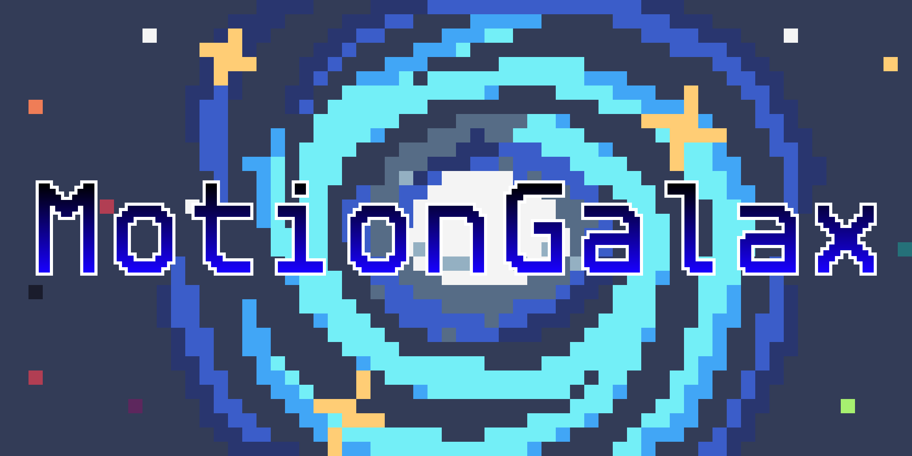

# Motion galax

 Motiongalax is a text effect libary from the [löve2d engine](https://love2d.org/) made in  
lua  by Foxy and it is in the version: __0.1__  
start devlopment: __september 20th 2023__,  
last modify: __september 22th 2023__

# Features
- simple use
- fast
- costumizable effects
- 7 effects

# How use it
- insert the libary folder with all members in your lovegame project and require it  
`mg = require("motiongalax")`
- now make a new effect setting a variable and defining the effect name, duration, mode and is in looping  
`effect = mg.newEffect(effectName, duration, mode, isLooping)`
- use the below command to draw and update it  
`effect:print(text, x, y, sx, sy, ox, oy)`  
`effect:update(dt, timerSpeed)`

# Effects
|Effect name|What it will do|
|---|---|
|typewrite|text will appear like someone writing|
|fade|increase text opacit|
|pushTop|push the text from right|
|pushLeft|push the text from top|
|resize|make the text grow|
|slideBar|make the text appear using a slidebar|
|blink|make the text blink|
